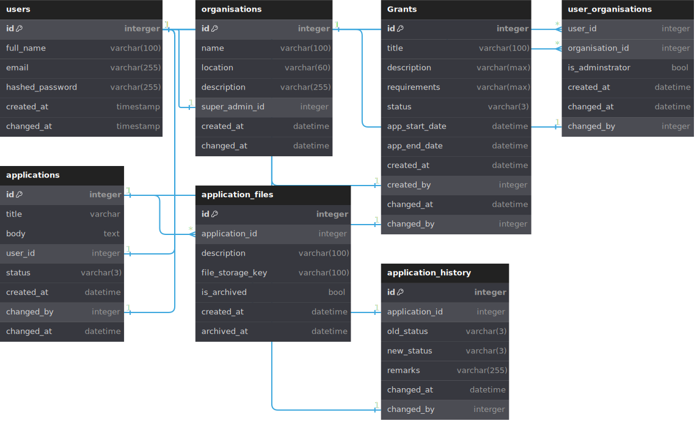
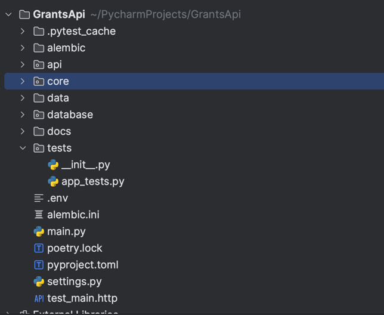

# Development Notes for GrantsApp

## Objective:
Design and implement a SaaS platform route where private companies can post Grants,
and users can apply for those Grants by submitting detailed proposals. Imagine LinkedIn
but for grant posting and applying for Grants.

## Use cases:
1. Organisation admins can post Grants.
2. Users can search and join organisations
3. Users can search for Grants
4. Users can apply for public Grants or organisation Grants.
5. Users can upload supporting documents for applications
6. Administrators can allow applications, approve, reject.
7. Users can view the status of their applications.
8. Organisation admin can add or remove other admins.

## Database Design
While designing the database we focus only on the above use-cases.
1. **Users** : details of the user account
2. **Organisations** : details of the organisation
3. **Grants** : Details of Grant, supported by organisation and has an admin.
4. **UserOrgs** : List of organisations user is part of or admin of
5. **Applications** : Grant applications
6. **ApplicationHistory** : History of processing done on grant application
7. **ApplicationFiles** : Stores metadata about files uploaded as supporting documents

[initial_db.sql](initial_db.sql)

## System Design
Application system architecture should always be inline with the usage and resource constraints. 
An application supporting 10000 requests per day looks way different than the one supporting 10 Million requests per 
day. With that note out of the way. We can still create an application which behaves like a monolithic application 
but is architected in a way that it can refactored to a microservices architecture easily.

### Assumptions taken
- The application is used by large multinational organisations who have wide set of Grants that employees or others can apply for.
    Assuming that 20K organisations are utilising the platform and each supports atleast 4 grant per year. Each organisation has atleast 5 users and atleast 2 applications for a grant cycle .
    In total 20K Grants per quarter and each 40K applications per quarter, each with 1Mb supporting files. 
- File storage per quarter = 40000*1Mb = 40 GB per quarter or 160 GB Per year
- Atleast 2 users per organisation are accessing the platform for day. 40K users per day
- Majority of the access is reading about Grants, or checking the status of the grant applications. Read Heavy workload

### Architecture Decisions
- With the current usage pattern assumptions, Monolithic architecture is sufficiently good for the platform. That being said
  Looking at the further scale and read-heavy workload, we can segregate the application into highlevel services
  - Authorisation Service
  - User Service
  - Organisation Service
  - Grants Service
  - Application Service

- User client or 3rd party applications can access the application through an API gateway which along with Application Firewall,
provides API management, app load balancer, access control and security boundary
- With our current architecture, the app servers are scalable this helps in load distribution and better throughput.
- Redis is deployed as a Cache and Session Manager to store frequently accessed data. For exmaple most widely searched Grants.
  - Redis also doubles as a session manager to store user session details and preferences. 
- In the next layer a load balancer is deployed to automatically scale individual services and repair faulty service instances. This also doubles up as a request router transfering requests from app servers to services layer.
- We deployed Event Bus or Queue for inter service cordination or triggering backgorund tasks. 
- Async Task workers are created to handle specific functions like notifications, emails or image optimisation, compressing etc.
- Another load balancer is deployed to handle routing of data store traffic.
- There are 3 types of data that are utilised in the application:
  - Master data: User profiles, organisation profiles
  - Transaction Data: Grants and Grant applications
  - Blog Storage: To store supporting documents
- All the routes in each of the services are to be controlled through secure access. We utilise the Auth tokens issued by authorisation service
to find the user roles and permissions. 
- With lower scale we can run the application services in a single server reducing the complexity but as the usage increases the load balancers will scale the services as required.

## Application Structure
- The following libraries and tools are utilised to build this application
  - FastAPI
  - Pydantic
  - SQL Alchemy ORM with SQL Lite
  - Python Multi-part for File uploads
  - Alembic for database Migrations
- Further libraries planned but not used in this version
  - Celery for background tasks
  - Redis for Caching and PostgreSQL for data store
    - Tried utilising Supabase postgres but due to configuration issues, unable to use it with SQL Alchemy
  - Github actions based CI/CD workflow
  - Docker compose and React Front-end
- To use Alembic we need to first init the repository
  - `alembic init`
  - The update the url and base meta data for automatic migration scripts
  - `alembic revision --autogenerate -m "simplied relationships" `
  - `alembic upgrade +1`
- To use SQL alchemy we first need to select which database dialect to workwith
  - Choose SQL Lite for simplicity
  - then we need to create enginer by providing the db details
  - create a declarative base to auto populate database metadata that is used for DB ORM access
  - Create the database models.
  - All the database related code is stored in database [database](..%2Fdatabase)folder
- I divided the app into multiple components:
  - `Core` -> Application Domain level models, the repository objects that handle the db interactions
  - `api` -> the API endpoints with different routes for `grants`, `organisations`, `users` and a common utility for 
             that are used across services
  - `tests` -> the Pytest container that contains all the tests. #todo use text fixtures to handle tests
  - GrantsAPI -> main folder housing the entry point of the application, configuration, and poetry dependency file.
  - The secrets are stored in .env file -> Pydantic has good support for loading enviornment variable.
